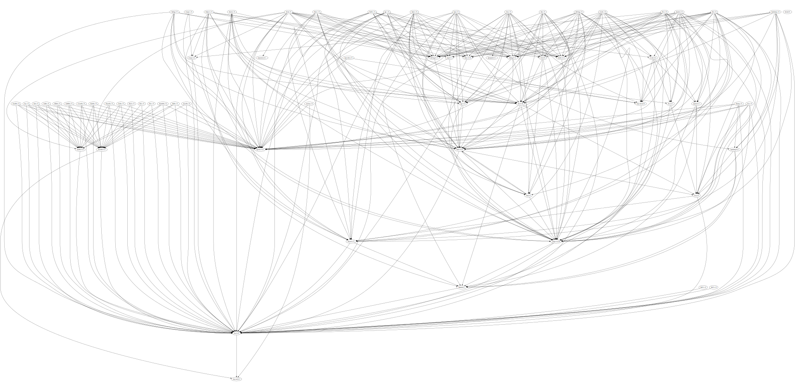

# headerFileAnalysis
C/C++ include files analysis

## Usage

Linux 下使用
``` bash

# Compiler
bash build.sh
# 或者使用 make
make

# Run (use Lua as a Example)
./headerFileAnalysis path/to/your/project/

```


## How to generate .dot file to a picture

1. install graphviz. if you use Ubuntu OS, run
``` bash

sudo apt-get install graphviz

```

if you use Windows. download it from [graphviz website](https://graphviz.org/download/)
don't forget add graphviz to your system path.


2. install VScode plugin  Graphviz Preview(author: EFanZh)

3. in VSCode, open a dot file, then you can find a button on upper left of the window.
click it, you can see a picture like

### use command line to generate output file

```bash
# pdf format
$ dot -Tpdf -o output.pdf input.dot
# svg format
$ dot -Tsvg -o output.svg input.dot
```
mor output format see [Graphviz Output Formats Document](https://graphviz.org/docs/outputs/)




